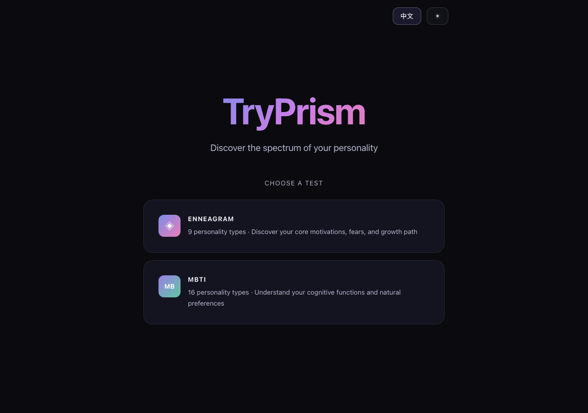
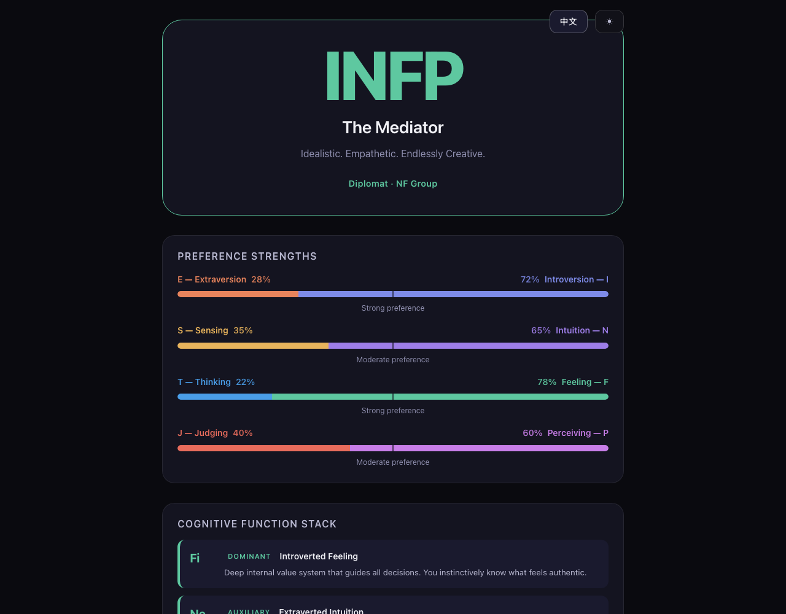

# TryPrism

A bilingual personality test web app supporting **Enneagram** and **MBTI** assessments. Built with React + TypeScript, featuring dark/light themes, PDF export, and full Chinese/English language support.



## Features

- **Two personality frameworks** — Enneagram (9 types) and MBTI (16 types)
- **Quick & Full modes** — shorter assessments for quick results, or comprehensive tests for detailed insights
- **Bilingual** — complete Chinese and English support, switchable anytime
- **Dark/Light themes** — premium calm aesthetic with prismatic accent colors
- **Detailed results** — type descriptions, cognitive function stacks (MBTI), growth/stress arrows (Enneagram), career paths, and more
- **PDF export** — save your results as a beautifully formatted PDF document
- **History** — revisit past test results from both frameworks
- **Fully static** — no backend, no database, no tracking. Your data stays in your browser.

### MBTI Results



The MBTI results page includes:
- 4-letter type with preference strength bars across all four dichotomies (E/I, S/N, T/F, J/P)
- Cognitive function stack (dominant through inferior) with descriptions
- Comprehensive sections: overview, strengths, blind spots, growth areas, career paths, and communication style
- All content available in both English and Chinese

## Tech Stack

- **React 18** + **TypeScript 5.6**
- **Vite 6** for build and dev server
- **react-router-dom 7** for routing
- **jsPDF** + **html2canvas** for PDF export
- **Vitest** for unit testing, **Playwright** for E2E testing

## Getting Started

```bash
npm install
npm run dev
```

Open [http://localhost:5173](http://localhost:5173) in your browser.

## Scripts

| Command | Description |
|---------|-------------|
| `npm run dev` | Start development server |
| `npm run build` | Production build |
| `npm run preview` | Preview production build |
| `npm test` | Run unit tests |
| `npm run test:run` | Run unit tests (CI mode) |
| `npm run test:e2e` | Run E2E tests |

## Built with Ratchet

This project was implemented using [**Ratchet**](https://github.com/ethannortharc/ratchet), an intent-driven autonomous execution framework for AI agents (Claude Code plugin).

Ratchet transforms high-level intent ("add MBTI personality test") into a structured spec with verifiable constraints, then autonomously executes the implementation through work packages with a keep-best ratchet loop.

### How it went

- **Enneagram test** — the initial personality test was built entirely by Ratchet in one autonomous session. Only one manual fix was needed afterward: a PDF export issue with CJK font rendering.
- **MBTI test** — successfully implemented in a single Ratchet session with zero manual fixes. The autonomous pipeline (spec → environment prep → test generation → planning → execution → verification) delivered all 8 work packages, passing 134 unit tests and 117 E2E tests on completion.

## License

[Apache License 2.0](LICENSE)
